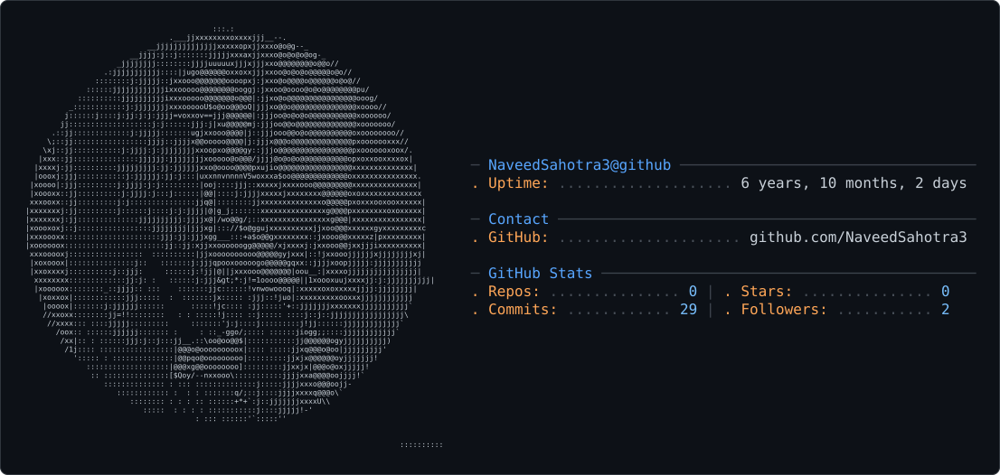

<picture>
  <source media="(prefers-color-scheme: dark)" srcset="dark_mode.svg" />
  <source media="(prefers-color-scheme: light)" srcset="light_mode.svg" />
  
</picture>

<h1 align="center">Naveed Sahotra</h1>

  <strong>Senior Full-stack Engineer | AI Engineer | SaaS Builder</strong>

  Building intelligent, scalable software with modern JavaScript technologies and Generative AI.

---

## 👋 About Me

I'm a Senior Full-stack JavaScript Engineer focused on building production-ready web applications, AI-powered SaaS products, and intelligent automation systems.

- 💻 Senior Full-stack JavaScript Engineer
- 🤖 Building AI Agents, LLM-powered applications, and intelligent automation
- 🧠 MS Computer Science with research in Generative AI
- 🎨 Research focused on Stable Diffusion and LLM-based prompt engineering
- 🚀 Founder & CEO of Coding Trip Global
- ☁️ Experienced with AWS, Docker, Supabase, PostgreSQL, and modern cloud architecture
- 📍 Faisalabad, Pakistan

## 🧠 AI & Research

My academic and professional work sits at the intersection of **software engineering, Generative AI, and intelligent automation**.

### 🎓 MS Research

**Text-to-Image Using Stable Diffusion with Refinement of Prompt Engineering Using LLMs**

My research explored the use of Large Language Models to refine prompts for Stable Diffusion-based text-to-image generation.

**Research interests:**

`Generative AI` `LLMs` `AI Agents` `Prompt Engineering` `Stable Diffusion` `Human-AI Interaction`

## 🛠️ Tech Stack

### Frontend
`JavaScript` `TypeScript` `React` `Next.js` `React Native` `Redux` `Tailwind CSS`

### Backend
`Node.js` `Express.js` `REST APIs` `Socket.IO`

### AI & Research
`AI Agents` `LLMs` `LangChain` `LangSmith` `Stable Diffusion` `Prompt Engineering`

### Databases
`PostgreSQL` `Supabase` `MongoDB` `Prisma`

### Cloud & DevOps
`AWS` `Docker` `DigitalOcean` `Nginx` `CI/CD`

### Testing & Collaboration
`Jest` `Mocha` `Cypress` `Git` `GitHub` `Jira` `Agile/Scrum`

## 💼 Professional Experience

### 🤖 Zannova
**Senior Full-stack Web & Mobile App Developer**

Building an AI-powered Accounting & HR platform focused on intelligent automation and natural-language interaction.

- 🤖 Developed AI Agents capable of performing complex multi-step operations
- 🧠 Built natural-language database interaction for financial data
- ⚡ Developed AI-powered workflow automation
- 🏗️ Designed scalable full-stack architecture
- ☁️ Worked with Next.js, Node.js, TypeScript, Supabase, Docker, AWS, LangChain and LangSmith

### 🚀 Coding Trip Global
**Founder & CEO**

Building AI-powered SaaS solutions and working with businesses to transform ideas into modern digital products.

### 💻 Maxenius Solution
**Full-stack JavaScript Engineer**

Worked on production applications including:

- 🎬 **TicketKite** - Online cinema ticket platform serving 10k+ daily users
- 💊 **Refine Pharma** - UK healthcare platform serving 10k+ daily users
- 🏥 Pharmacy inventory systems supporting 25+ live pharmacy websites

## 📈 Production Experience

| Area | Experience |
|---|---|
| 👥 Daily Users | 10k+ production users |
| 🏥 Healthcare | 25+ live pharmacy websites |
| 🧩 UI Engineering | 100+ reusable components |
| 🏗️ Architecture | Full-stack scalable applications |
| 🤖 AI | AI Agents & natural-language automation |

## 🎓 Education

**MS Computer Science**  
The University Faisalabad, Pakistan · 2022–2024

**BS Computer Science (Hons.)**  
Government College University, Faisalabad, Pakistan · 2016–2020

## 🌎 Languages

🇬🇧 English · C2  
🇵🇰 Urdu · Native  
Punjabi · C2

## 🤝 Let's Connect

  <a href="https://www.linkedin.com/">LinkedIn</a> •
  <a href="https://github.com/NaveedSahotra3">GitHub</a>

